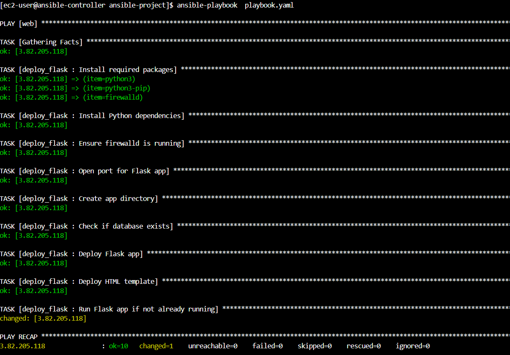
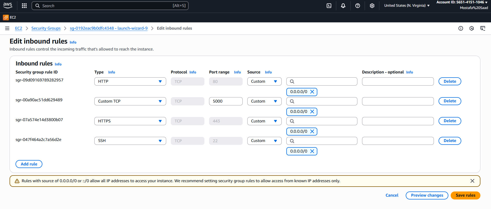
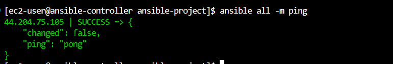
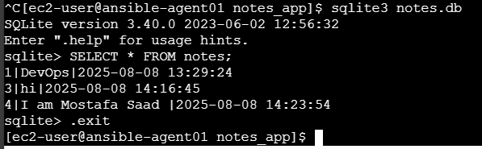
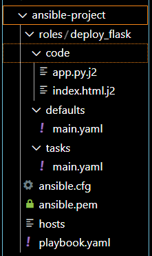
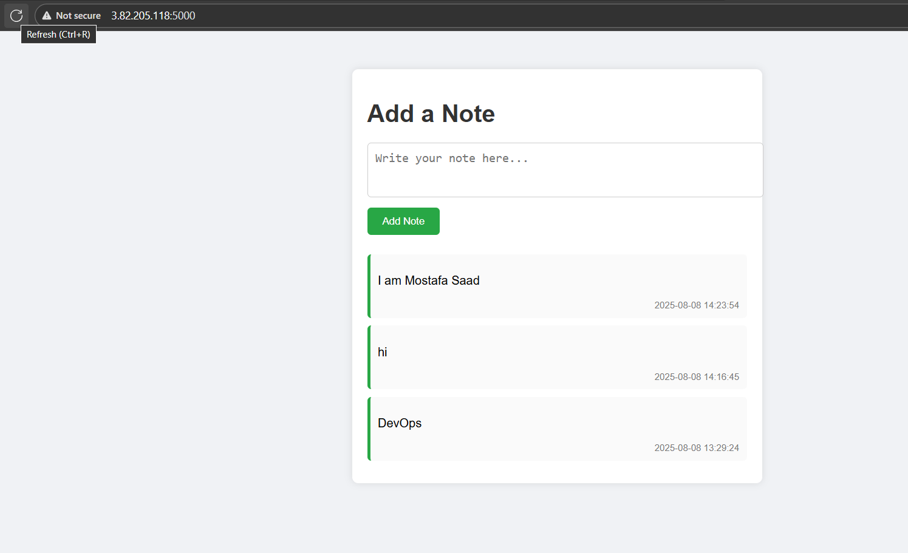

Deploy Flask Notes App on AWS EC2 with Ansible
# 1. Environment Setup on AWS EC2 (Amazon Linux)
- Launch an EC2 instance with Amazon Linux AMI (similar to RHEL).
- Choose instance type (e.g., t2.micro for testing).
- Configure Security Group to allow inbound ports:
  - SSH (port 22) from your IP.
  - HTTP (port 5000) from anywhere (0.0.0.0/0) or your IP for testing.
- Generate or use existing SSH key pair for access.

2. Ansible Controller and Inventory Setup
- On your local machine or a separate server, install Ansible.
- Create an host file (e.g., inventory) with content:

3. Create Ansible Playbook and Role for Deployment

# 4 Running the Application with VS code :
- Connect to EC2 instance:
-  Test connection with host :

# 6. Configure Security Group
- Make sure inbound rules allow port 5000 (TCP) from your IP or anywhere for testing.
- This allows browser access to Flask server running on port 5000.

7. Run the playbook :

8 Running the Application:

9. Verifying Data in SQLite Database

10. Source of Code:

## Screenshots

